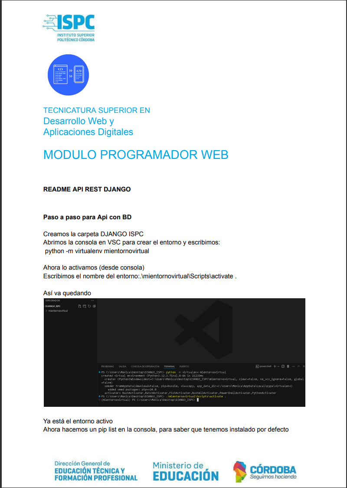
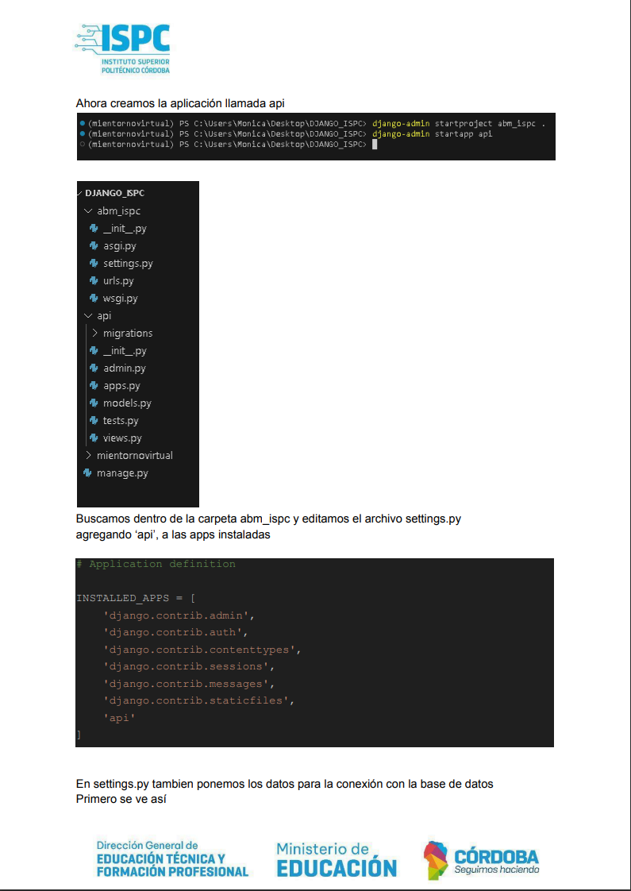
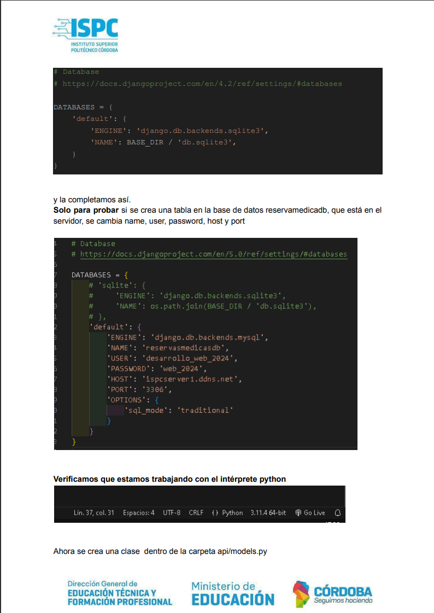
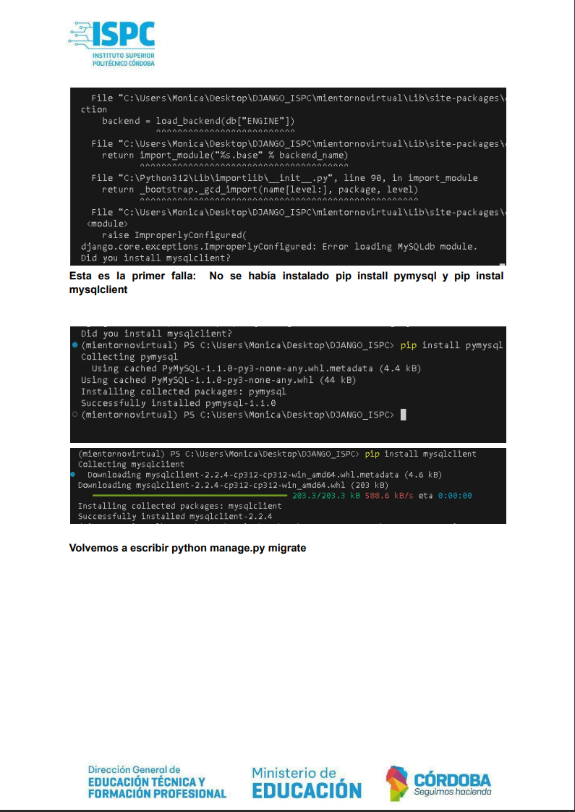
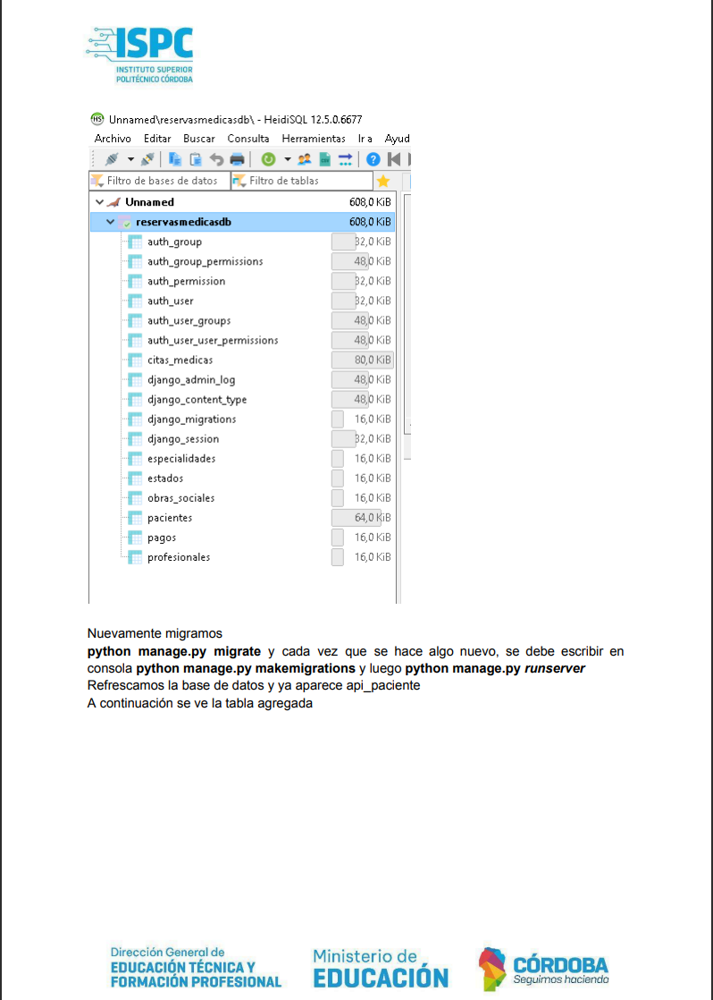
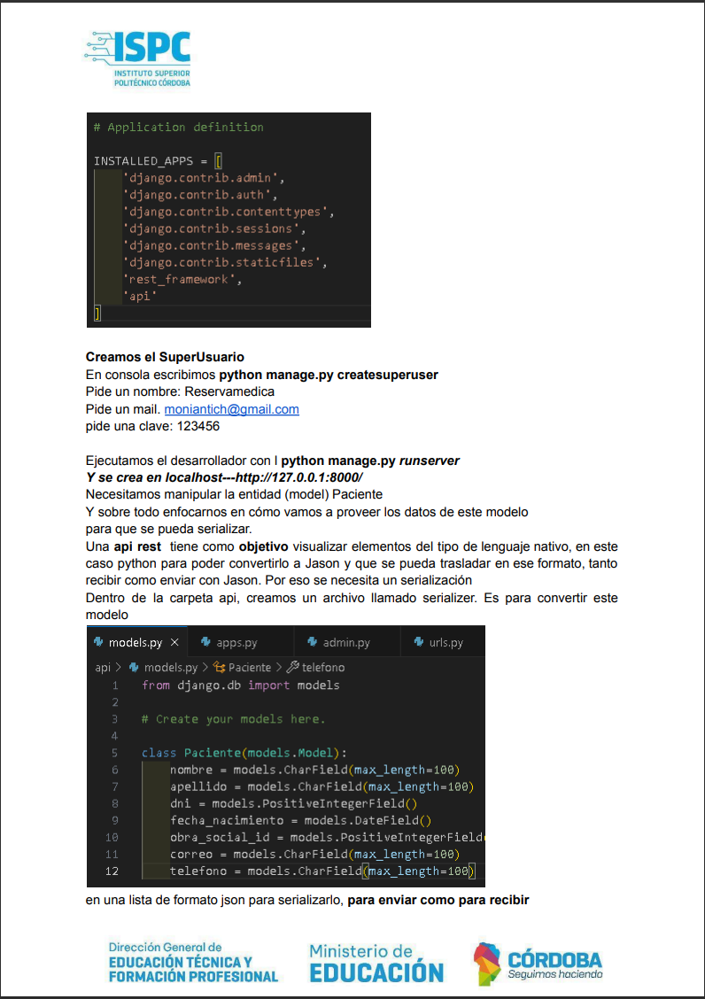
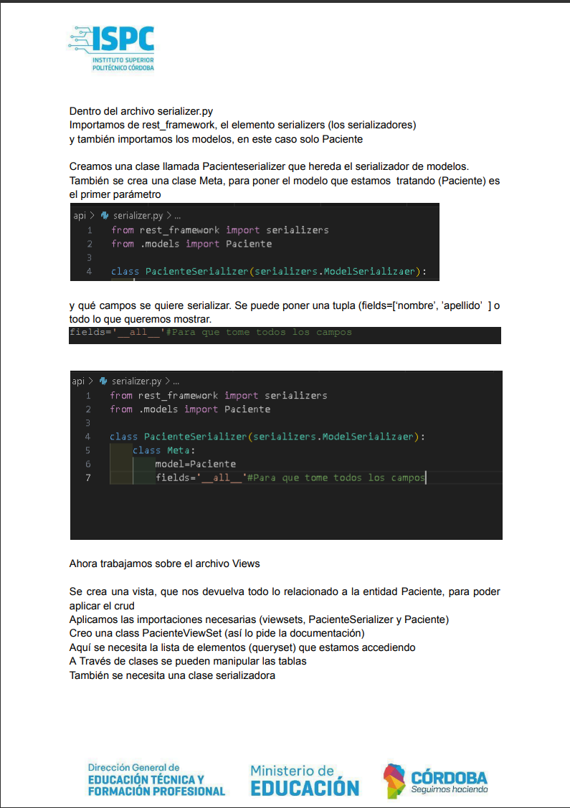
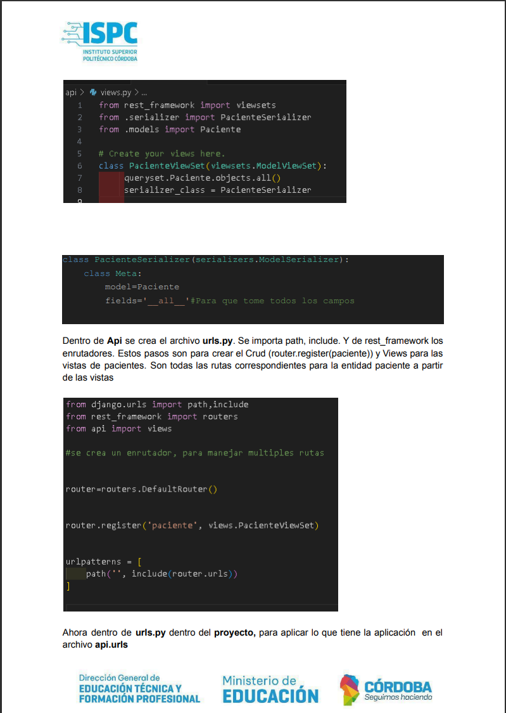
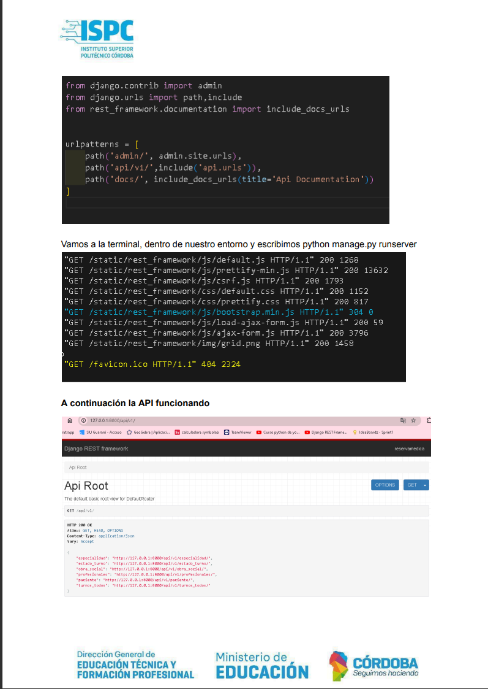
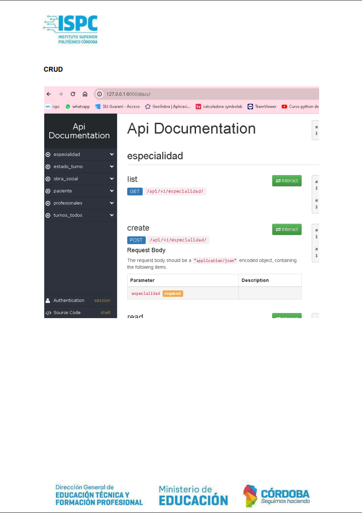

# Api Rest con Django

## Superuser

- Nombre:reservamedica
- mail: moniantich@gmail.com
- clave: 123456

## Base de datos  

* URL: ispcserver1.ddns.net  
* Usuario: desarrollo_web_2024  
* Password: web_2024  
* Puerto: 3306

La información para la conexión a la base de datos se encuentra en la siguiente ubicacion:  
BackEnd --> abm_ispc --> settings.py  

## Integrantes del Grupo

- Patricia Castillo
- Monica Antich
- Jesica Aramayo
- Alejo Lucero
- Matias Sorrentino

